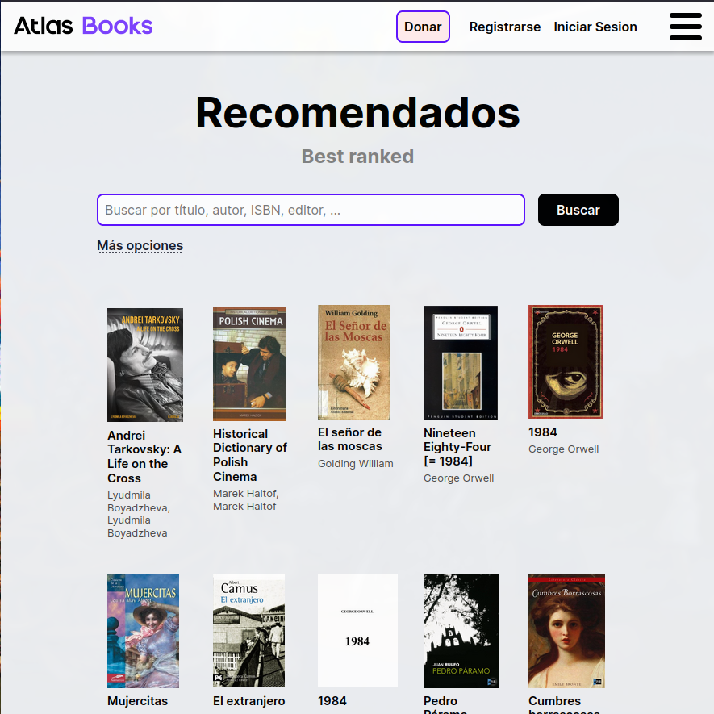

# AtlasBooks 📚

**Welcome to AtlasBooks!** 🎉

AtlasBooks is a web-based library platform designed to let users upload, download, rate, and comment on books in a seamless and collaborative environment. Inspired by Z-Library, this project demonstrates our skills in full-stack development, emphasizing quality, usability, and performance.

**[🚀 Check out the live demo here!](https://atlasbooks.netlify.app/)**

This repository contains the frontend code for AtlasBooks, built with the PERN stack (PostgreSQL, Express, React, and Node.js).

<!--

  

-->
<!-- https://github.com/jfmonsa/AtlasBooks-front/assets/81452967/8dd09f11-87a3-45e9-8479-ac7943c542ac -->

## 🌟 Key Features

### 📄 User Profiles

- **User Registration & Authentication**: Secure login with JWT.
- **Personalized Profiles**: Manage name, email, country, and more.
- **Download History**: View all previously downloaded books.

### 🏠 Home Page

- **Recommended Books Feed**: Curated suggestions based on user preferences.
- **Advanced Search**: Filter books by author, title, genre, and publication date.

### 📚 Book Management

- **Upload Books**: Drag-and-drop functionality for book files and cover images.
- **Book Pages**: Download, rate, comment, and share books directly from their dedicated pages.
- **Recommendations**: Personalized suggestions based on your downloads and book lists.
- **Report Books**: Flag inappropriate content to maintain a quality library

### 📋 List Management

- **Create Lists**: Organize your reading journey with custom book lists.
- **Public Lists**: Share your lists with the community or explore others' collections.

### Admin options

- **User Management**: Ban/unban users violating platform policies.
- **Reports Dashboard**: Address flagged books and user issues effectively.

## 🛠 Tech Stack

- **Frontend**: Built with React.js and Vite, emphasizing responsive and accessible design using modern CSS techniques.
- **Backend**: Developed using Node.js and Express for robust API handling.
- **Database**: PostgreSQL powers efficient data storage and management.

### Other Tools

- **Jira**: Agile project management to track progress.
- **Figma**: UI/UX design tools for creating an intuitive user interface. Explore the design [here](https://www.figma.com/design/mgwoKhiK6PWJEddFpD78te/AtlasBooks?node-id=0-1&t=AN7QX4QfWvHQWtBI-1)

## 📝 Installation & Contribution

We welcome contributions to enhance AtlasBooks! 🚀
Please review our [contributing guidelines](CONTRIBUTING.md) for detailed instructions on setting up the project and submitting pull requests.

## 👩‍💻 Team Members

Meet the passionate team behind AtlasBooks:

- [Isabella Rebellón Medina](https://github.com/Issabella09) - [Email](mailto:isabella.rebellon@correounivalle.edu.co)
- [Juan Felipe Monsalve Vargas](https://github.com/jfmonsa) - [Email](mailto:juan.felipe.monsalve@correounivalle.edu.co)
- [Jose Luis Ramos Arango](https://github.com/RamSterB) - [Email](mailto:jose.luis.ramos@correounivalle.edu.co)
- [Juan Sebastian Marin Serna](https://github.com/JSebastianMarin) - [Email](mailto:juan.marin.serna@correounivalle.edu.co)
- [Juan Pablo Idarraga](https://github.com/JuanPidarraga) - [Email](mailto:idarraga.juan@correounivalle.edu.co)
- [Leider Santiago Cortes](https://github.com/LeiderCortes) - [Email](mailto:cortes.leider@correounivalle.edu.co)
- [Nicolás Prado León](https://github.com/NicolasPL64) - [Email](mailto:nicolas.prado@correounivalle.edu.co)
